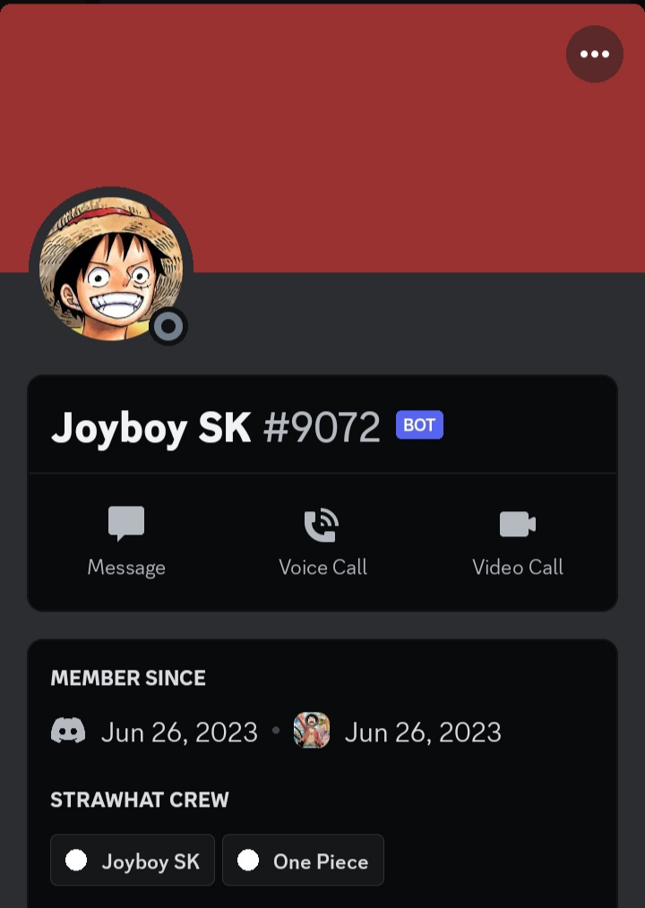
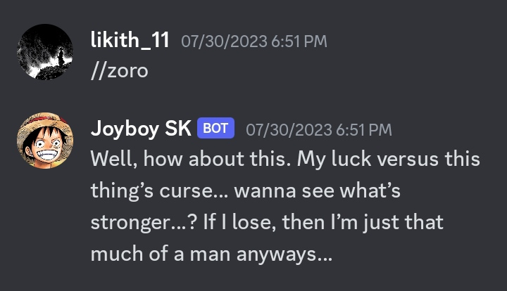
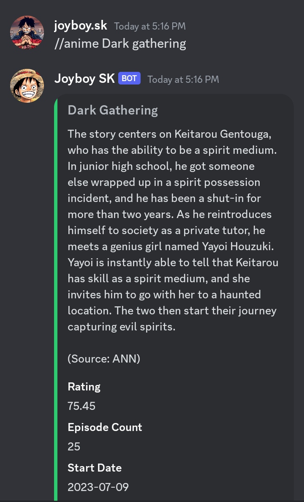
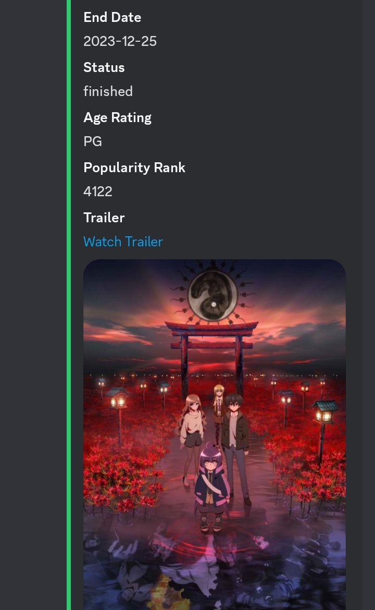
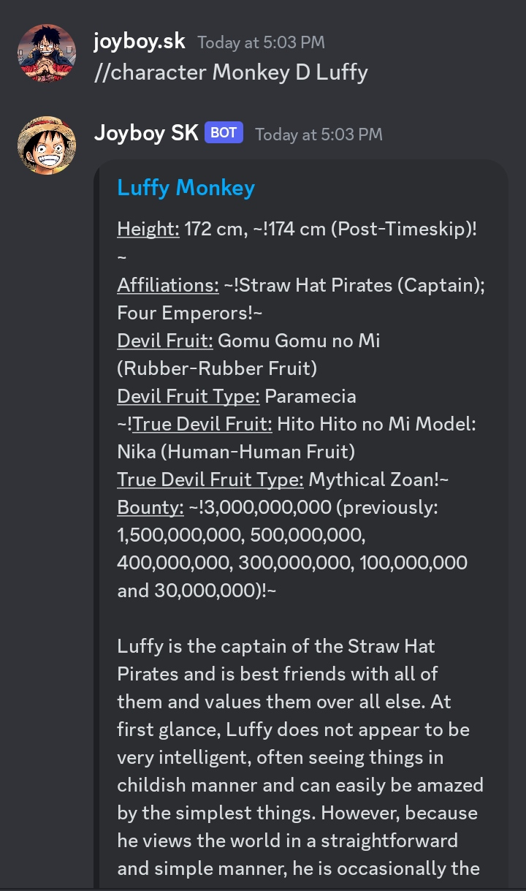
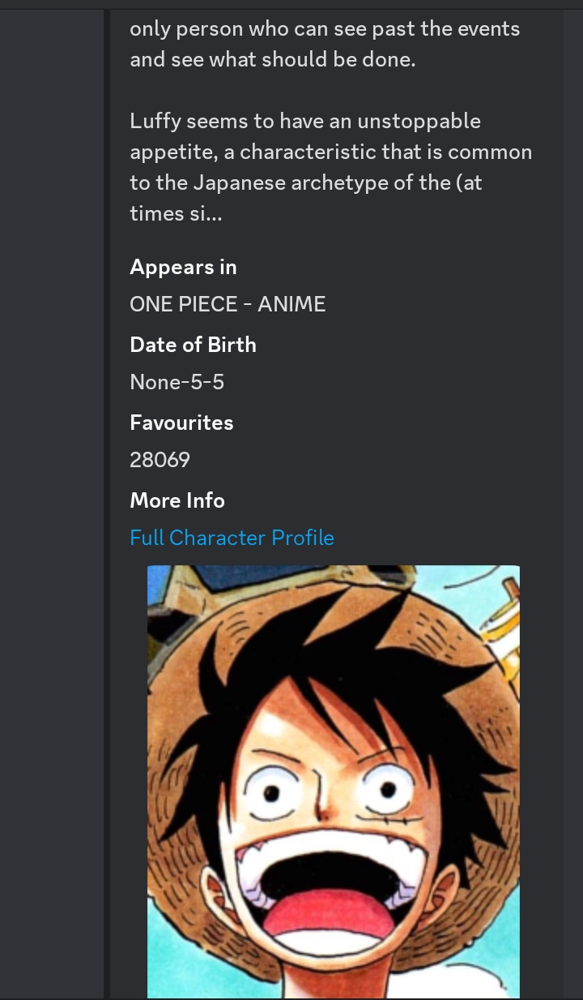
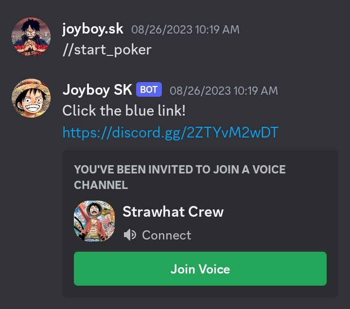
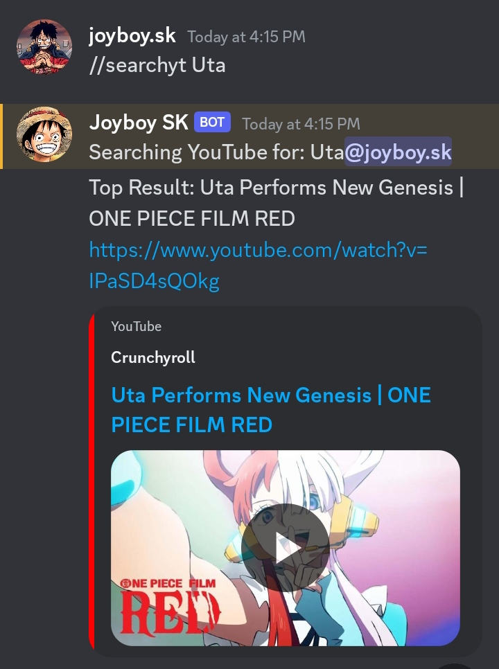
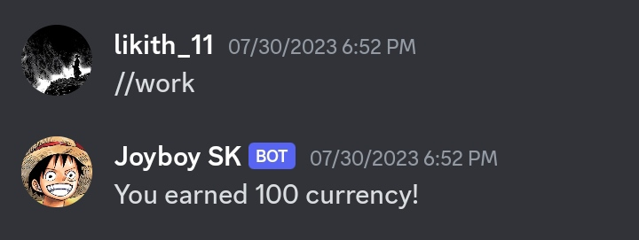

<h1>Anime Discord Bot</h1>
<a href="https://discord.com/invite/uUBmxs9nME"></a>

[](https://discord.com/invite/uUBmxs9nME)
[](https://github.com/playscrbot/Joyboy-SK)
[](https://github.com/playscrbot/Joyboy-SK)

A Fun and Games Discord bot designed for anime community with many features tailored towards anime content.

## Key Features ✨
**Anime character quotes**: Get quotes from popular anime characters like Luffy and Zoro from One Piece

<a href="https://discord.com/invite/uUBmxs9nME"></a>

**Anime GIF searches**: Look up GIFs from your favorite anime shows

**Anime recommendations**: Find new anime to watch based on title searches to know how much it is worth your time.

<a href="https://discord.com/invite/uUBmxs9nME"></a>
<a href="https://discord.com/invite/uUBmxs9nME"></a>

**Anime info from APIs**: Pull detailed anime info like studios, characters, etc from AniList and Kitsu

**Anime Character Searches**: Search for your favorite Anime character or a random character from anime to know more about them.

<a href="https://discord.com/invite/uUBmxs9nME"></a>
<a href="https://discord.com/invite/uUBmxs9nME"></a>

**Manga info**: Get details on manga series using the AniList API

**AI chat**: Talk directly to ChatGPT AI assistant about anime topics

**Weather**: Get weather report and forecasts of your location

**Games**: Play mini games like Rock Paper Scissors and Poker with other users

<a href="https://discord.com/invite/uUBmxs9nME"></a>

**Reddit search**: Look up top Reddit posts on a given anime

**Embeds**: Create customized embeds for messaging

**YouTube search**: Find YouTube videos on a given anime topic

<a href="https://discord.com/invite/uUBmxs9nME"></a>

**Quora search**: Search Quora for anime Q&A

**Profile cards**: Create customizable profiles for each user

**Custom Welcome Messages**: Welcome your new Discord members in a flashy message which will make them happy.

**Economy & games**: Earn virtual currency by working, gambling games

<a href="https://discord.com/invite/uUBmxs9nME"></a>

And much more!


## Getting Started 🌈
### Dependencies
```bash
Python 3.6 or higher
discord.py
discord_together
python-dotenv
requests
beautifulsoup4
openai
pillow
aiohttp
httpx
giphy_client
youtubesearchpython
translate
feedparser
numpy
Repl.it or other hosting platform
```


### Installing
Clone the repo: git clone https://github.com/playscrbot/Joyboy-SK.git

#### Install dependencies 
`pip install -r requirements.txt`

Create a `.env` file with your Discord bot token and API keys
Run bot.py to start the bot

#### Executing program
Run `python bot.py` to start the bot
Test commands by messaging the bot on Discord


## Technical Details 👾

The bot is built in Python using the `discord.py` API wrapper. It leverages the following key technical elements:

**Object oriented design**: Bot features are split into cog files by category for easier management.

**API integrations**: AniList, Kitsu, OpenWeather, etc APIs are used to pull rich data.

**Async programming**: Asyncio is used for non-blocking operations like API calls.

**Persistent storage**: User data like profiles and currency is saved locally.

**Web scraping**: Beautiful Soup is used to scrape sites.

**Error handling**: Try/except blocks handle potential errors from API calls.

**Commands framework**: discord.py command decorators are used for easy command creation.

**Hosting**: Uptime Robot and Repl.it keep the botpersisitently hosted.


## FAQ 🎴

### How do I add the bot to my server?

To add the bot to your server, use the following invite link: [Bot Invite Link](https://discord.com/invite/uUBmxs9nME). Follow these steps:

1. Click on the invite link.
2. Select the server you want to add the bot to.
3. Grant necessary permissions.
4. Confirm and complete the setup.

### What permissions does the bot need?

The bot requires the following permissions for full functionality (Don't worry, I am not stealing any of your data as I have no database):
  - Administrator

### Can I contribute features or improvements?

Yes, we welcome contributions! If you'd like to contribute, please follow these guidelines:
1. Fork the repository.
2. Create a new branch for your changes.
3. Make your enhancements.
4. Submit a pull request with a detailed description of your changes.

Feel free to reach out if you have any questions or need assistance.


## Roadmap 🧭
Vote for potential future bot features and enhancements:

 ✅ New game: Trivia
 
 ✅ Anime soundtrack search
 
 ✅ User leveling/experience system
 
 ✅ Anime character avatar generator

 ✅ Custom Dashboard

 ✅ A New Music Player

Visit here https://strawpoll.com/w4nWr6qQqyA to register your vote so i can start developing the best one right away!!

As Your feedback is valuable in shaping the direction of the bot's development!


## License 🚨
This project is licensed under the [MIT] License - see the LICENSE.txt file for details

## Author 🤗
<a href="https://youtube.com/@playscript"></a>
#### `👤 PlayScript`

Website: https://youtube.com/@playscript

### Made with ❤ and Python
